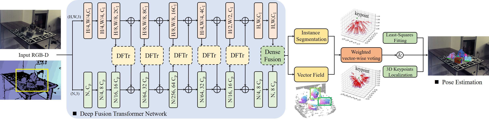

# Deep Fusion Transformer Network with Weighted Vector-Wise Keypoints Voting for Robust 6D Object Pose Estimation

[Jun Zhou](https://scholar.google.com/citations?user=pEgMa-UAAAAJ&hl=en)<sup>1,\*</sup>,
[Kai Chen](https://ck-kai.github.io/)<sup>2,\*</sup>,
[Qi Dou](http://www.cse.cuhk.edu.hk/~qdou/)<sup>2</sup>,
[Linlin Xu](https://scholar.google.com/citations?hl=en&user=CDEWI5IAAAAJ&view_op=list_works&sortby=pubdate)<sup>3</sup>,
[Jing Qin](https://research.polyu.edu.hk/en/persons/jing-qin)<sup>1</sup><br>
<sup>1</sup>The Hong Kong Polytechnic University, <sup>2</sup>The Chinese University of Hong Kong, <sup>3</sup>University of Waterloo

<sup>\*</sup>denotes equal contribution

<p align="center">

</p>

## Abstract
> One critical challenge in 6D object pose estimation from a single RGBD image is efficient integration of two different modalities, i.e., color and depth. In this work, we tackle this problem by a novel Deep Fusion Transformer (DFTr) block that can aggregate cross-modality features for improving pose estimation. Unlike existing fusion methods, the proposed DFTr can better model cross-modality semantic correlation by leveraging their semantic similarity, such that globally enhanced features from different modalities can be better integrated for improved information extraction. Moreover, to further improve robustness and efficiency, we introduce a novel weighted vector-wise voting algorithm that employs a non-iterative global optimization strategy for precise 3D keypoint localization while achieving near real-time inference. Extensive experiments show the effectiveness and strong generalization capability of our proposed 3D keypoint voting algorithm. Results on four widely used benchmarks also demonstrate that our method outperforms the state-of-the-art methods by large margins.

## Quick usage
Please follow [FFB6D](https://github.com/ethnhe/FFB6D) to prepare the datasets and the environment. And 
```bash
1. Integrate the DFTr blocks into the FFB6D network architecture to replace the original feature fusion module.
2. Using the weighted vector-wise voting algorithm to detect the predefined keypoints' position.
```


## Citation
If you find the code useful, please cite our paper.

## Acknowledgment
Thanks to the authors for providing the [MP6D](https://github.com/yhan9848/MP6D) dataset. Our code is developed based on [FFB6D](https://github.com/ethnhe/FFB6D) and [Fang](https://github.com/DocF/multispectral-object-detection/tree/main). We thank the authors for providing the source code.
